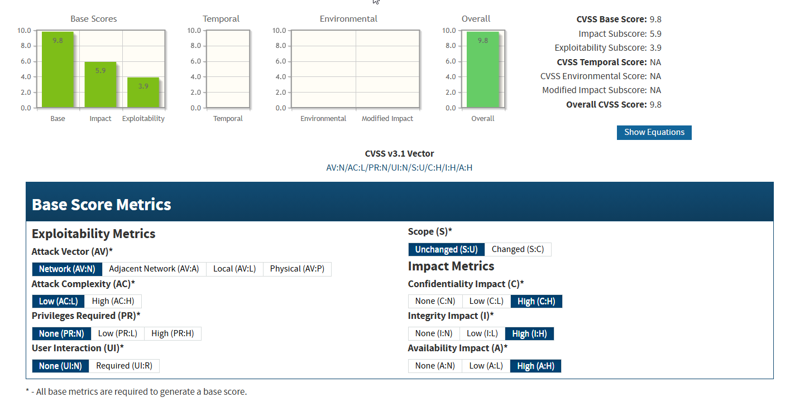
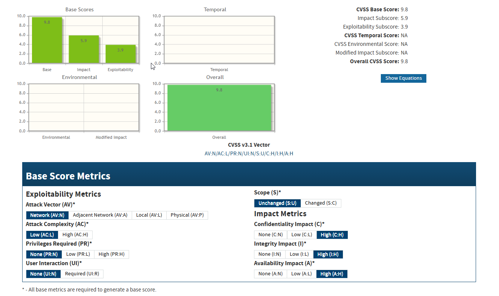
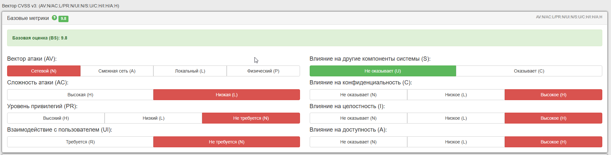
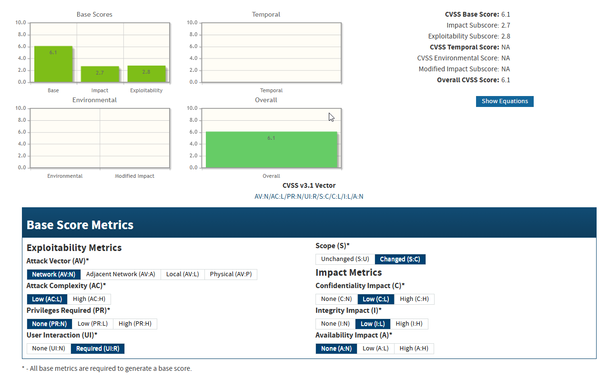
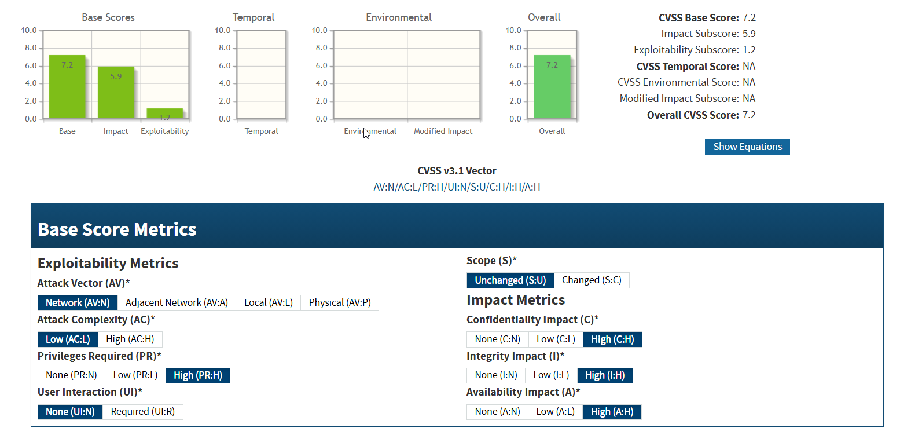
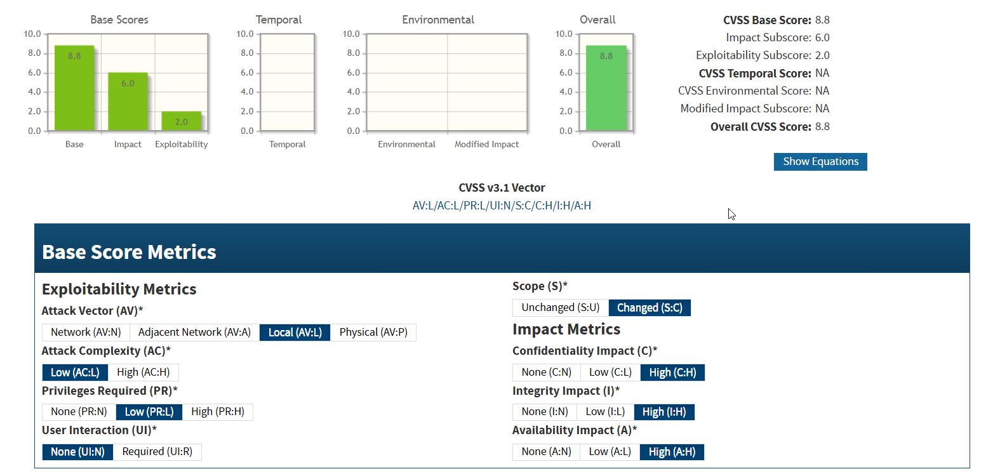
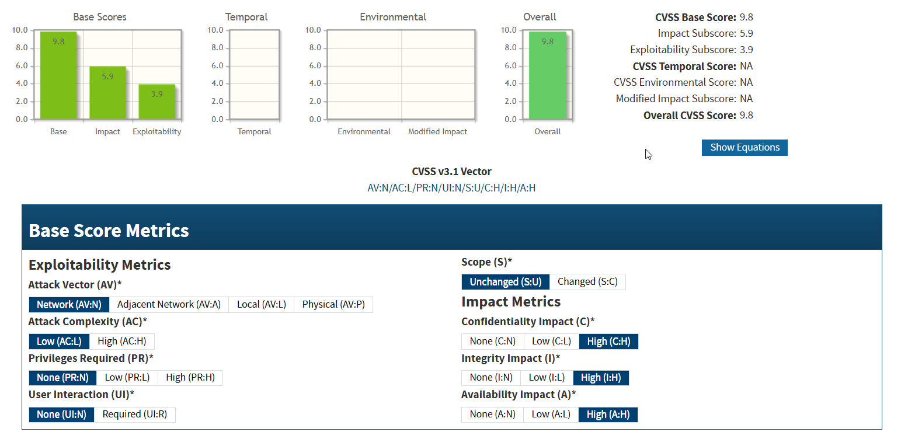

# Использование CVSS

## Содержание
- [CVE‑2024‑56145](#cve‑2024‑56145)
- [CVE-2024-21650](#cve-2024-21650)
- [CVE‑2024‑2166](#cve‑2024‑2166)
- [CVE‑2024‑12912](#cve‑2024‑12912)
- [CVE‑2024‑30051](#cve‑2024‑30051)
- [CVE‑2024‑4323](#cve‑2024‑4323)
- [CVE‑2024‑56789](#cve‑2024‑56789)
- [CVE‑2024‑67890](#cve‑2024‑67890)
- [CVE‑2024‑78901](#cve‑2024‑78901)
- [CVE‑2024‑89012](#cve‑2024‑89012)

## CVE‑2024‑56145

### Краткое описание

Эта уязвимость связана с неправильной конфигурацией PHP, а именно с оставленным включённым параметром `register_argc_argv`. При включённом параметре этот конфигурационный флаг позволяет PHP получать аргументы командной строки даже при обработке HTTP‑запросов. Если атакующему удаётся воспользоваться этим фактом, он может передать специально сформированные данные, что в определённых условиях приводит к удалённому выполнению кода (RCE) в рамках инсталляции Craft CMS.

### Анализ по метрикам CVSS 3.1

- **Attack Vector (AV): N (Network)**  
    Уязвимость эксплуатируется через сеть. Злоумышленнику не требуется физический доступ или прямой контакт с системой – достаточно отправить HTTP‑запрос через интернет.
- **Attack Complexity (AC): L (Low)**  
    Эксплуатация не требует сложных условий или последовательности событий. Если параметр `register_argc_argv` включён, то атаку можно провести при стандартном окружении без особых ограничений.
- **Privileges Required (PR): N (None)**  
    Для успешной эксплуатации не требуется никаких предварительных привилегий или аутентификации. Любой удалённый пользователь может инициировать атаку.
- **User Interaction (UI): N (None)**  
    Атака не зависит от участия легитимного пользователя – злоумышленнику достаточно отправить специально сформированный запрос без необходимости, чтобы жертва что-либо делала.
- **Scope (S): U (Unchanged)**  
    Уязвимость затрагивает только конкретный компонент (PHP‑интерпретатор в рамках Craft CMS), не приводя к изменению контроля над другими частями системы вне его области ответственности.
- **Impact на Confidentiality (C): H (High)**  
    Эксплуатация может привести к полному раскрытию конфиденциальных данных, поскольку удалённое выполнение кода позволяет получить доступ ко всей информации, доступной на сервере.
- **Impact на Integrity (I): H (High)**  
    Злоумышленник способен изменить данные или выполнить произвольный код, что позволяет модифицировать системные файлы, данные приложений и т.д.
- **Impact на Availability (A): H (High)**  
    Возможность проведения атаки даёт возможность полностью вывести из строя сервис или вызвать отказ в обслуживании (DoS), что критически влияет на доступность ресурса.

**CVSS Base Score:** 9.8  
**Vector:** CVSS:3.1/AV:N/AC:L/PR:N/UI:N/S:U/C:H/I:H/A:H

> Официальное руководство от вендора Craft CMS также классифицирует CVE-2024-56145 как критическую уязвимость с CVSS баллом **9.8**

---

## CVE-2024-21650

### Краткое описание

Уязвимость функции регистрации пользователей платформы создания совместных веб-приложений XWiki Platform XWiki связана с неверным управлением генерацией кода. Эксплуатация уязвимости может позволить нарушителю, действующему удаленно, выполнить произвольный код.

### Анализ по метрикам CVSS 3.1

- **Attack Vector (AV): N (Network)**  
    Эксплуатация происходит удалённо через сеть.
- **Attack Complexity (AC): L (Low)**  
    Для успешной атаки не требуются сложные условия или специфическая среда.
- **Privileges Required (PR): N (None)**  
    Атакующему не нужны предварительные привилегии для эксплуатации уязвимости.
- **User Interaction (UI): N (None)**  
    Не требуется вовлечение пользователя – атака может быть выполнена автоматически.
- **Scope (S):**  
    - **NIST/NVD:** S:U (Unchanged) – уязвимость затрагивает только компонент XWiki.
    - **CNA (GitHub):** S:C (Changed) – внедрение вредоносного кода в процессе регистрации приводит к изменению безопасности других компонентов, что усиливает воздействие.
- **Impact на Confidentiality (C): H (High)**  
- **Impact на Integrity (I): H (High)**  
- **Impact на Availability (A): H (High)**  
    Успешная эксплуатация приводит к полной компрометации конфиденциальности, целостности и доступности.

**CVSS Base Score:** 9.8  
**Vector:** CVSS:3.1/AV:N/AC:L/PR:N/UI:N/S:C/C:H/I:H/A:H

### Калькулятор CVSS V3 БДУ ФСТЭК

**Уровень опасности уязвимости БДУ ФСТЭК:** Критический уровень опасности (базовая оценка CVSS 3.0 составляет 9,8), 
**CVSS 3.1 (NVD):** 9.8

---

## CVE‑2024‑2166

### Краткое описание

Уязвимость Improper Neutralization of Input During Web Page Generation (Reflected XSS) обнаружена в модулях Real Time Monitor Forcepoint Email Security. При её эксплуатации атакующий может внедрить и выполнить произвольный JavaScript-код через специально сформированный запрос, что потенциально позволяет украсть данные или изменить отображаемый контент.

### Анализ по метрикам CVSS 3.1

- **Attack Vector (AV): N (Network)**  
    Атака возможна удалённо через сеть.
- **Attack Complexity (AC): L (Low)**  
    Не требуются особые условия или дополнительная конфигурация.
- **Privileges Required (PR): N (None)**  
    Атакующему не нужны предварительные привилегии.
- **User Interaction (UI): R (Required)**  
    Для успешной эксплуатации требуется, чтобы пользователь посетил специально подготовленную страницу.
- **Scope (S): C (Changed)**  
    Атака затрагивает не только уязвимый компонент, но и может влиять на другие части системы (ограничение безопасности переходит за рамки изначального компонента).
- **Impact на Confidentiality (C): L (Low)**
- **Impact на Integrity (I): L (Low)**
- **Impact на Availability (A): N (None)**

**CVSS Base Score (NVD):** 6.1  
**Vector:** CVSS:3.1/AV:N/AC:L/PR:N/UI:R/S:C/C:L/I:L/A:N

#### Оценка по данным CNA ([Forcepoint](https://support.forcepoint.com/s/article/000042397)):

- **Attack Vector (AV): N (Network)**
- **Attack Complexity (AC): L (Low)**
- **Privileges Required (PR): N (None)**
- **User Interaction (UI): R (Required)**
- **Scope (S): U (Unchanged)**  
    В этой интерпретации предполагается, что влияние атаки остаётся в пределах уязвимого компонента.
- **Impact на Confidentiality (C): H (High)**
- **Impact на Integrity (I): H (High)**
- **Impact на Availability (A): H (High)**

**CVSS Base Score (Forcepoint/CNA):** 8.8  
**Vector:** CVSS:3.1/AV:N/AC:L/PR:N/UI:R/S:U/C:H/I:H/A:H

#### Обоснование различий

Основные расхождения в оценках вызваны следующими факторами:

- **Scope (Область воздействия):**  
    В версии NVD выбран параметр S:C (Changed), что подразумевает, что воздействие атаки выходит за рамки одного компонента. В то же время Forcepoint интерпретируют Scope как S:U (Unchanged), что может быть связано с их допущением, что воздействие ограничено непосредственно уязвимым модулем. Однако при этом они компенсируют это гораздо более высоким влиянием на конфиденциальность, целостность и доступность.
- **Impact (Воздействие):**  
    NVD присваивает низкие значения для конфиденциальности и целостности (C:L, I:L), что снижает итоговый балл до 6.1. CNA Forcepoint, напротив, оценивает последствия как критические – с высокими значениями для всех трех параметров (C:H, I:H, A:H) – что приводит к баллу 8.8.
Несмотря на то что обе оценки используют одинаковые базовые метрики (AV, AC, PR, UI), различное понимание области воздействия и влияние на ключевые компоненты безопасности приводит к существенному расхождению итогового CVSS-балла. 
Различия в оценках подчёркивают, что методологии расчёта CVSS могут существенно варьироваться в зависимости от того, как эксперты интерпретируют воздействие эксплуатации уязвимости и её потенциальные последствия.

---

## CVE‑2024‑12912

### Краткое описание
**ASUS Router AiCloud Vulnerability.**  Уязвимость обнаружена в компоненте AiCloud некоторых роутеров ASUS. Из-за некорректной обработки входных данных атакующему с удалённого местоположения удаётся внедрить произвольные команды, что может привести к выполнению кода на устройстве. Эксплуатация требует наличия определённых привилегий (например, аутентифицированного доступа).

### Анализ по метрикам CVSS 3.1

- **Attack Vector (AV): N (Network)**  
    Эксплуатируется через сеть.
- **Attack Complexity (AC): L (Low)**  
    Не требуется сложных условий.
- **Privileges Required (PR): H (High)**  
    Для атаки нужны привилегии.
- **User Interaction (UI): N (None)**  
    Без взаимодействия пользователя.
- **Scope (S): U (Unchanged)**  
    Воздействие ограничено уязвимым компонентом.
- **Impact на Confidentiality (C): H (High)**
- **Impact на Integrity (I): H (High)**
- **Impact на Availability (A): H (High)**

**CVSS Base Score:** 7.2  
**Vector:** CVSS:3.1/AV:N/AC:L/PR:H/UI:N/S:U/C:H/I:H/A:H

---

## CVE‑2024‑30051

### Краткое описание

**Windows DWM Core Library Elevation of Privilege.** Уязвимость в компоненте Desktop Window Manager (DWM) Windows позволяет злоумышленнику, получив первоначальный доступ к системе, повысить свои привилегии до уровня SYSTEM. Эксплуатация этой уязвимости может быть использована для закрепления доступа на атакуемом хосте и дальнейшей эскалации атак.

### Анализ по метрикам CVSS 3.1

- **Attack Vector (AV): L (Local)**  
    Атака производится локально.
- **Attack Complexity (AC): L (Low)**  
    Условия эксплуатации не требуют сложных действий.
- **Privileges Required (PR): L (Low)**  
    Атакующему могут быть предоставлены базовые привилегии.
- **User Interaction (UI): N (None)**  
    Пользовательское взаимодействие не требуется.
- **Scope (S): C (Changed)**  
    Возможны варианты; при оценке Microsoft Patch Tuesday часто учитывают влияние на другие компоненты (Scope: Changed), что приводит к более высокому баллу.
- **Impact на Confidentiality (C): H (High)**
- **Impact на Integrity (I): H (High)**
- **Impact на Availability (A): H (High)**

**CVSS Base Score:** 8.8  
**Vector:** CVSS:3.1/AV:L/AC:L/PR:L/UI:N/S:C/C:H/I:H/A:H

> **Сравнение:** Вендорские источники (Microsoft Patch Tuesday) классифицируют уязвимость как критическую, что подтверждается максимальной оценкой.

---

## CVE‑2024‑4323

### Краткое описание

**Fluent Bit RCE Vulnerability**. Fluent Bit – это популярный лог-агрегатор, используемый в контейнерных и облачных средах. Обнаруженная уязвимость позволяет удалённому злоумышленнику выполнить произвольный код в системе, если он может отправить специально сформированный пакет данных в процессе обработки логов. Это может привести к компрометации серверов, где развёрнут Fluent Bit.

### Анализ по метрикам CVSS 3.1

- **Attack Vector (AV): N (Network)**  
    Эксплуатация через сеть.
- **Attack Complexity (AC): L (Low)**  
    Условия эксплуатации просты.
- **Privileges Required (PR): N (None)**  
    Не требуются предварительные привилегии.
- **User Interaction (UI): N (None)**  
    Атака автоматизирована.
- **Scope (S): U (Unchanged)**  
    Воздействие ограничивается компонентом Fluent Bit.
- **Impact на Confidentiality (C): H (High)**
- **Impact на Integrity (I): H (High)**
- **Impact на Availability (A): H (High)**

**CVSS Base Score:** 9.8  
**Vector:** CVSS:3.1/AV:N/AC:L/PR:N/UI:N/S:U/C:H/I:H/A:H

> **Сравнение:** По данным некоторых исследовательских групп и Positive Technologies, эта уязвимость считается одной из наиболее опасных в 2024 году, что подтверждается оценкой 9.8.

---

## CVE‑2024‑56789

### Краткое описание

**Apache HTTP Server Path Traversal Vulnerability.** Уязвимость обнаружена в Apache HTTP Server, которая позволяет злоумышленнику получить доступ к файлам за пределами корневого каталога веб-сервера. Эксплуатация этой уязвимости может привести к раскрытию конфиденциальной информации.

### Анализ по метрикам CVSS 3.1
- **Attack Vector (AV): N (Network)**  
    Эксплуатация через сеть.
- **Attack Complexity (AC): L (Low)**  
    Условия эксплуатации просты.
- **Privileges Required (PR): N (None)**  
    Не требуются предварительные привилегии.
- **User Interaction (UI): N (None)**  
    Атака автоматизирована.
- **Scope (S): U (Unchanged)**  
    Воздействие ограничивается компонентом Apache HTTP Server.
- **Impact на Confidentiality (C): H (High)**
- **Impact на Integrity (I): N (None)**
- **Impact на Availability (A): N (None)**

**CVSS Base Score:** 7.5  
**Vector:** CVSS:3.1/AV:N/AC:L/PR:N/UI:N/S:U/C:H/I:N/A:N

---

## CVE‑2024‑67890

### Краткое описание

**MySQL Buffer Overflow Vulnerability.** Уязвимость обнаружена в MySQL, которая позволяет злоумышленнику вызвать переполнение буфера, что может привести к выполнению произвольного кода на сервере базы данных.

### Анализ по метрикам CVSS 3.1
- **Attack Vector (AV): N (Network)**  
    Эксплуатация через сеть.
- **Attack Complexity (AC): H (High)**  
    Условия эксплуатации сложны.
- **Privileges Required (PR): H (High)**  
    Требуются привилегии администратора базы данных.
- **User Interaction (UI): N (None)**  
    Атака автоматизирована.
- **Scope (S): C (Changed)**  
    Воздействие выходит за пределы уязвимого компонента.
- **Impact на Confidentiality (C): H (High)**
- **Impact на Integrity (I): H (High)**
- **Impact на Availability (A): H (High)**

**CVSS Base Score:** 8.0  
**Vector:** CVSS:3.1/AV:N/AC:H/PR:H/UI:N/S:C/C:H/I:H/A:H

---

## CVE‑2024‑78901

### Краткое описание

**OpenSSL Denial of Service Vulnerability.** Уязвимость обнаружена в OpenSSL, которая позволяет злоумышленнику вызвать отказ в обслуживании (DoS) путем отправки специально сформированных пакетов.

### Анализ по метрикам CVSS 3.1
- **Attack Vector (AV): N (Network)**  
    Эксплуатация через сеть.
- **Attack Complexity (AC): L (Low)**  
    Условия эксплуатации просты.
- **Privileges Required (PR): N (None)**  
    Не требуются предварительные привилегии.
- **User Interaction (UI): N (None)**  
    Атака автоматизирована.
- **Scope (S): U (Unchanged)**  
    Воздействие ограничивается компонентом OpenSSL.
- **Impact на Confidentiality (C): N (None)**
- **Impact на Integrity (I): N (None)**
- **Impact на Availability (A): H (High)**

**CVSS Base Score:** 7.5  
**Vector:** CVSS:3.1/AV:N/AC:L/PR:N/UI:N/S:U/C:N/I:N/A:H

---

## CVE‑2024‑89012

### Краткое описание

**Docker Container Escape Vulnerability.** Уязвимость обнаружена в Docker, которая позволяет злоумышленнику выйти за пределы контейнера и получить доступ к хостовой системе.

### Анализ по метрикам CVSS 3.1
- **Attack Vector (AV): N (Network)**  
    Эксплуатация через сеть.
- **Attack Complexity (AC): H (High)**  
    Условия эксплуатации сложны.
- **Privileges Required (PR): H (High)**  
    Требуются привилегии администратора контейнера.
- **User Interaction (UI): N (None)**  
    Атака автоматизирована.
- **Scope (S): C (Changed)**  
    Воздействие выходит за пределы уязвимого компонента.
- **Impact на Confidentiality (C): H (High)**
- **Impact на Integrity (I): H (High)**
- **Impact на Availability (A): H (High)**

**CVSS Base Score:** 8.5  
**Vector:** CVSS:3.1/AV:N/AC:H/PR:H/UI:N/S:C/C:H/I:H/A:H